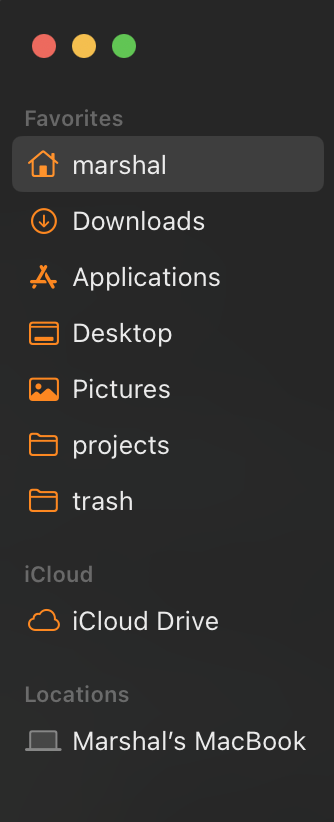

## dotfiles

Config files and settings used on my macOS powered machines

### Background soft

Most of the soft described below you can find in my stars list: https://github.com/stars/MarshalX/lists/soft-tools

- Magnet (paid from App Store. Open Source alternative: Rectangle) – windows manager
- Hidden Bar – menu bar cleaner
  - auto-hide after 1 min
- Maccy – clipboard manager
- Grammarly – fix my freaking english
- iStat Menus (paid from App Store) – machine resources in the menu bar
- 1Password – password manager
- TextSnipper (paid from App Store) – like default screenshot tool but capture text from anywhere on the screen
  - capture text shortcut: ⌥ + \` 
- The Unarchiver – unarchiver that supports more extensions 
- Recess (paid from App Store) – helps take a breaks
- Raycast – replacement of spotlight
- uBlock Origin Late – adblock for Safari
- Tailscale – VPN
- MonitorControl – Better support of external monitors

Full list is available [here](Brewfile).

### Configs

Backup stored in the private cloud using [mackup](https://github.com/lra/mackup).

Because of new macOS and how it handles symlinks we need to use this workaround:

Saving configs (when leaving a machine):
```shell
mackup backup && mackup uninstall
```

Loading configs (on new machine): 
```
mackup restore && mackup uninstall
```

### System Settings

- Sound -> Disable "Play sound on startup"
- Screen Time -> Enable "Share across devices"
- General -> Language & Region -> Preferred languages -> Only one "English (US) Primary"
- General -> Language & Region -> Region -> United States
- General -> Language & Region -> Date format -> 8/19/23
- General -> Language & Region -> Number format -> 1,234,567.89
- Appearance -> Accent Colour -> Orange
- Appearance -> Click in the scroll bar to -> Jump to the spot that's clicked
- Control Center -> Wi-Fi -> Don't Show in Menu Bar
- Control Center -> Sound -> Always Show in Menu Bar
- Control Center -> Now Playing -> Don't Show in Menu Bar
- Control Center -> Hearing -> Show in Control Center
- Control Center -> Keyboard Brightness -> Show in Control Center
- Desktop & Dock -> Disable "Show recent applications in Dock"
- Control Center -> Spotlight -> Don't Show in Menu Bar
- Privacy & Security -> App Store and identified developers
- Desktop & Dock -> Set "Size" about 1/4
- Desktop & Dock -> Automatically hide and show the menu bar -> Never
- Desktop & Dock -> Enable "Ask to keep changes when closing documents"
- Desktop & Dock -> Disable "Close windows when quitting an application"
- Desktop & Dock -> Default web browser -> Firefox
- Desktop & Dock -> Hot Corners -> Top Right -> Notification Centre
- Displays -> More Space
- Displays -> Disable "Automatically adjust brightness"
- Displays -> Night Shift -> Custom -> From 23:00 to 5:00
- Displays -> Advanced -> Disable "Slightly dim the display on battery"
- Displays -> Advanced -> Enable "Prevent automatic sleeping on power adapter when the display is off"
- Wallpaper -> select file from icloud dir -> Fill Screen
- Screen Saver (if not possible to disable) -> Hello -> Theme: minimal, disable "show hello in all langs", disable "match system appearance"
- Screen Saver (if not possible to disable) -> Enable "Show with clock" 
- Lock Screen -> Start Screen Saver when inactive -> Never (if not controlled by profile)
- Lock Screen -> Turn display off on battery when inactive -> Never
- Lock Screen -> Turn display off on power adapter when inactive -> Never
- Touch ID & Password -> Disable Apple Watch integration if enabled
- Internet Accounts -> Add Google accounts
- Keyboard -> Key repeat rate -> Fast
- Keyboard -> Delay until repeat -> Short
- Keyboard -> Keyboard brightness -> 0
- Keyboard -> Enable "Keyboard navigation"
- Keyboard -> Input Sources -> ABC, Russian – PC
- Trackpad -> More Gestures -> App Exposé -> Swipe Down with Three Fingers
- Printers & Scanners -> Default paper size -> A4

### Finder Settings:
- New Finder windows show -> Home
- Sidebar -> Disable "Recent", "AirDrop", "Shared", "Recent tags"
- Sidebar -> Enable "Home", "Pictures"
- Advanced -> Enable "Show all filename extensions"
- Advanced -> Enable "Remove items from the Trash after 30 days"
- Advanced -> When performing a search -> Search the Current Folder

- Apply this order of sidebar, add projects and trash folders:
  

### Shortcuts

Keyboard -> Keyboard shortcuts:
- Function Keys -> Enable "Use F1, F2, etc. keys as standard function keys"
- Screenshots:
  - Copy picture of screen to the clipboard: shift + cmd + \`
  - Copy picture of selected area to the clipboard: cmd + \`
- General -> Enable "Toggle Dark Mode"
- Spotlight -> Disable all shortcuts
- Accessibility -> Disable "Turn VoiceOver on or off"

1password:
- General -> Autofill: CMD + \
- Appearance -> Density -> Compact
- Appearance -> Always Show in Sidebar -> Disable "Tags"

TextSniper:
- Capture Text: option + \`
- Read QR/Bar Code: option + shift + \`

### Step-by-step guide

- Link Apple ID
- Install soft from sec team and so on
- Install Brew and bundle:
  - `xcode-select --install`
  - `export HOMEBREW_NO_INSTALL_FROM_API=1`
  - `/bin/bash -c "$(curl -fsSL https://raw.githubusercontent.com/Homebrew/install/master/install.sh)"`
  - add brew to .zprofile
  - call eval to run brew shell
  - `cd ~ && mkdir projects && cd projects`
  - `git clone https://github.com/MarshalX/dotfiles.git && cd dotfiles`
  - `brew bundle --file=Brewfile`
- Install ohmyzsh `sh -c "$(curl -fsSL https://raw.githubusercontent.com/ohmyzsh/ohmyzsh/master/tools/install.sh)"` 
- Restore configs: `cp ~/projects/dotfiles/.mackup.cfg ~ && mackup restore && mackup uninstall`
- Apply System Settings, Finder Settings and Shortcuts
- Open JetBrains Toolbox and install IntelliJ IDEA, CLion, Android Studio (sync cloud settings or export + import)
- Open installed apps and login/configure
